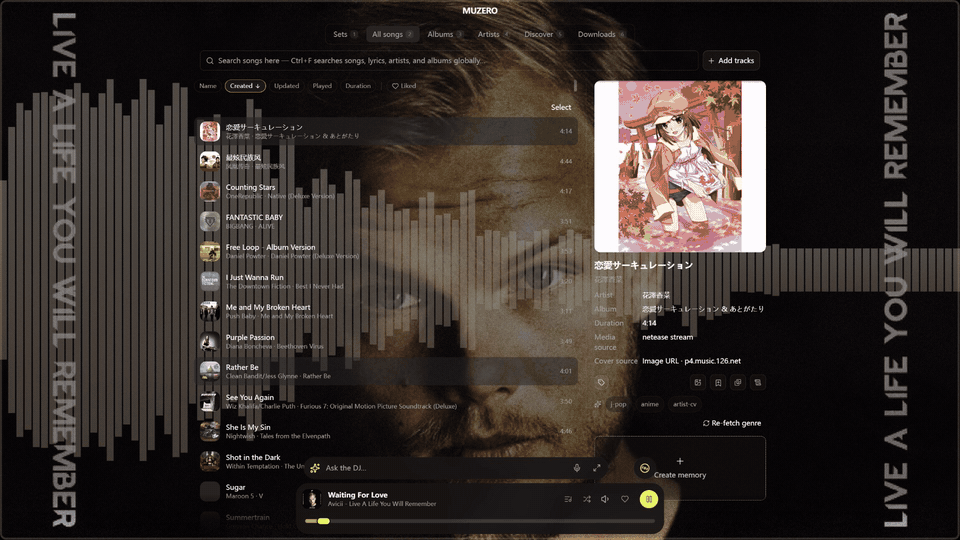

<div align="center">
  

# MUZERO

**Your private music bank, visual player, and AI DJ.**

MUZERO is a local-first music and video player for people whose songs are also memories.
It brings your private library, scattered online music sources, visual playback, cloud-drive
sync, and an LLM-powered DJ into one app.

[English](./README.md) · [简体中文](./README.zh-CN.md) · [日本語](./README.ja-JP.md) · [한국어](./README.ko-KR.md)

[mu0.app](https://mu0.app) · [Docs](https://mu0.app/docs) · [Changelog](./CHANGELOG.md) · [Product PRD](./docs/prd/20260612-muzero-product-positioning-readme-prd/20260612-muzero-product-positioning-readme-prd.md)

<br/>


</div>

---

## Screenshots

<table>
  <tr>
    <td width="50%" valign="top">
      <br/>
      <sub><b>Live visualizers &amp; lyrics</b> — cycle spectrum styles, then flip into lyrics mode.</sub>
    </td>
    <td width="50%" valign="top">
      <br/>
      <sub><b>Swipe to switch</b> — a 3D coverflow you flick through by touch.</sub>
    </td>
  </tr>
  <tr>
    <td width="50%" valign="top">
      <br/>
      <sub><b>Global ⌘F search</b> — across tracks, tags, lyrics, and online sources.</sub>
    </td>
    <td width="50%" valign="top">
      <br/>
      <sub><b>Set gallery</b> — sets, albums, artists, and smart playlists in one place.</sub>
    </td>
  </tr>
  <tr>
    <td width="50%" valign="top">
      <br/>
      <sub><b>Agent DJ</b> — connect an LLM to curate sets and take requests, like a DJ.</sub>
    </td>
    <td width="50%" valign="top">
      <br/>
      <sub><b>Customizable visuals</b> — flow background, palettes, effects, and themes.</sub>
    </td>
  </tr>
</table>

## What Is MUZERO?

MUZERO started from a simple idea: a private music bank, almost like a private museum.
Every song can carry notes, tags, cover photos, and memory fragments. When a track plays,
you can return to the time and place it belongs to.

It has since grown into four connected experiences:

- **Private music museum**: upload audio and music videos, annotate every track, and sync your library to storage you own.
- **Multi-source music hub**: search and play from NetEase Cloud Music, Bilibili, and YouTube on desktop, then keep those tracks in your MUZERO library.
- **Visual player**: Poweramp-inspired playback surfaces, reactive backgrounds, cover-driven palettes, and audio visualizers.
- **Agent DJ**: connect a local model or online LLM API, let it search your library, curate sets, or call music-generation APIs to create the next song.

You can use the free hosted service at [mu0.app](https://mu0.app), or clone the project and deploy the web build / optional sharing control plane yourself on Cloudflare. Core data stays local. Cross-device sync uses your own R2, S3-compatible storage, or WebDAV-style private cloud as the storage backend evolves.

## The Promise

| Principle | What it means |
|-----------|---------------|
| **Local-first** | Tracks, sets, notes, tags, covers, settings, playback stats, and media metadata live in the device-local IndexedDB database `muzero-db`. |
| **No MUZERO media backend** | MUZERO does not host your music library. Cloud sync points at storage you configure and own. |
| **BYOK** | LLM keys, music-generation keys, source login sessions, and storage credentials are stored locally on your device. |
| **Free hosted service** | `mu0.app` is free. It exists for distribution, web access, and optional share-link permission management, not for taking custody of your library. |
| **Explicit sharing boundary** | Only share links and permission metadata need the `mu0` service. Track bytes still come from your configured storage or local device. |

## Documentation

Full guides, highlights, and architecture live at **[mu0.app/docs](https://mu0.app/docs)**:

- [Getting started](https://mu0.app/docs/getting-started/) — open the app and import your first tracks
- [Sources & importing](https://mu0.app/docs/sources/) — uploads + NetEase, Bilibili, YouTube
- [Cloud sync](https://mu0.app/docs/sync/) — keep every device on the same library
- [Agent DJ](https://mu0.app/docs/agent-dj/) — connect a model and let it run the queue
- [Self-host & deploy](https://mu0.app/docs/self-host/) — run the web build yourself
- [Architecture](https://mu0.app/docs/architecture/) — data model, the DJ loop, project map, tech stack

Prefer the app? Open [my.mu0.app](https://my.mu0.app) or grab a desktop build from the [download page](https://mu0.app/download).

## Run Locally

Requirements: Node.js 24.16+, pnpm, and (for desktop/mobile) the Rust + Tauri prerequisites, Xcode, or the Android SDK/NDK.

```bash
fnm install
fnm use
make install
make dev            # web dev server → http://localhost:41730
make electron-dev   # Electron desktop shell
make check          # typecheck + lint + test
```

Full build/deploy and Tauri/mobile commands are in the [self-host guide](https://mu0.app/docs/self-host/).

## License

Apache-2.0. See [`LICENSE`](./LICENSE).
