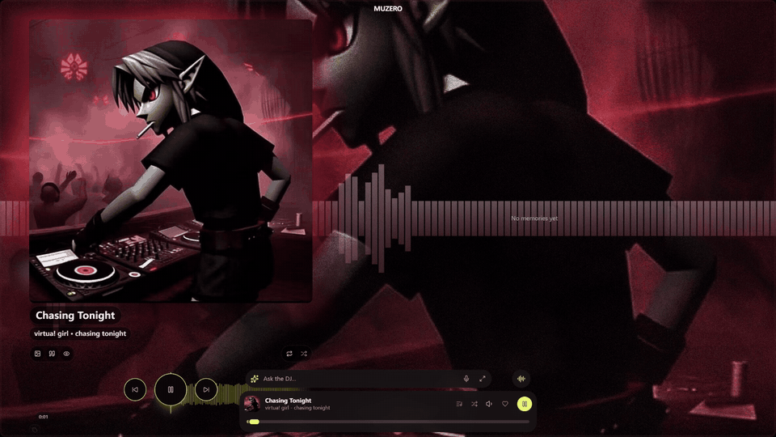
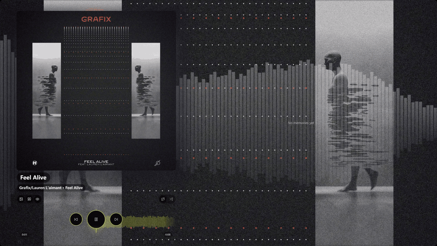
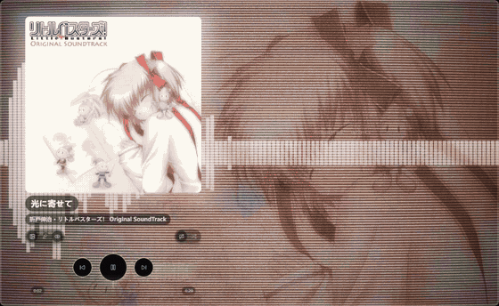
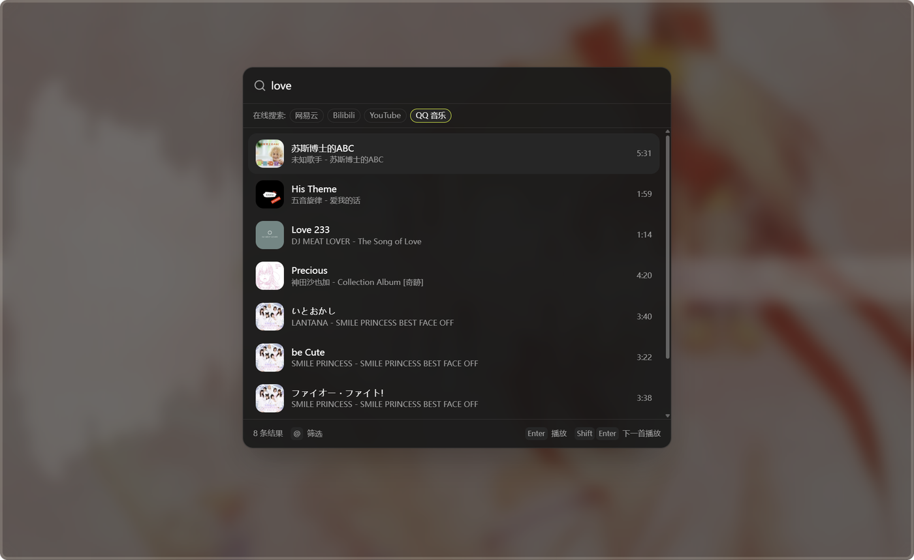
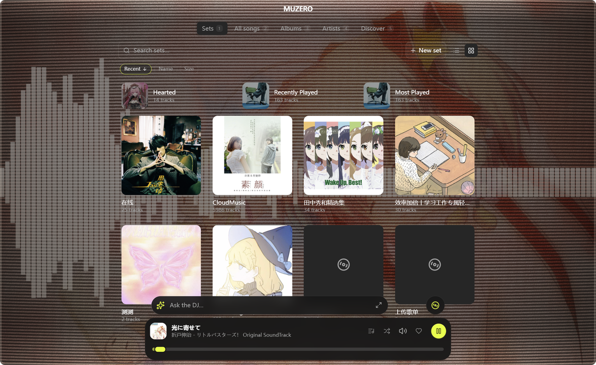
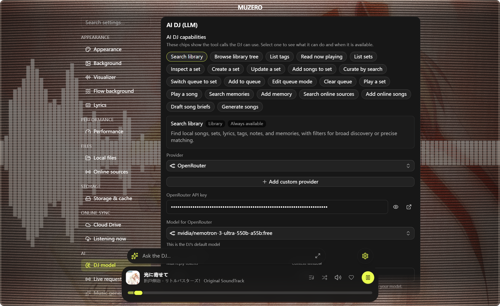
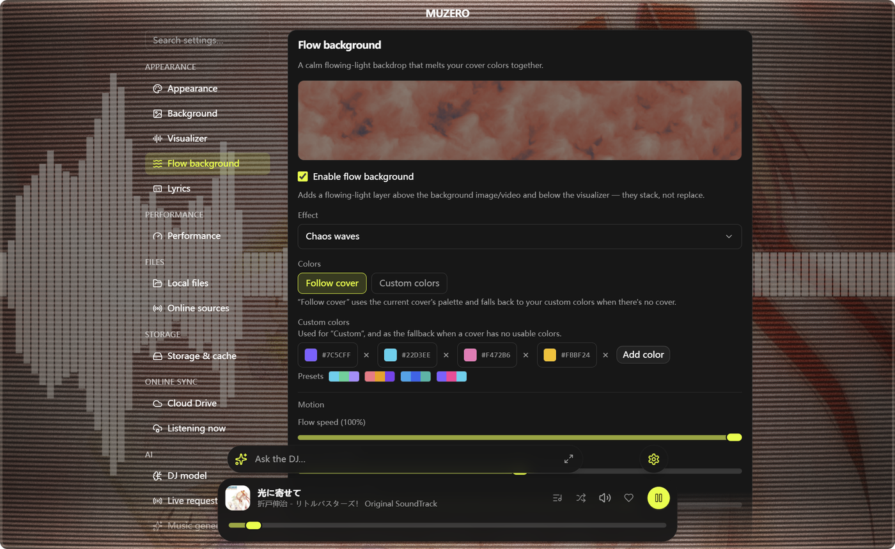

<div align="center">
  

# MUZERO

**Your private music bank, visual player, and AI DJ.**

MUZERO is a local-first music and video player for people whose songs are also memories.
It brings your private library, scattered online music sources, visual playback, cloud-drive
sync, and an LLM-powered DJ into one app.

[English](./README.md) · [简体中文](./README.zh-CN.md) · [日本語](./README.ja-JP.md) · [한국어](./README.ko-KR.md)

[mu0.app](https://mu0.app) · [Changelog](./CHANGELOG.md) · [Product PRD](./docs/prd/20260612-muzero-product-positioning-readme-prd/20260612-muzero-product-positioning-readme-prd.md)

<br/>



</div>

---

## Screenshots

<table>
  <tr>
    <td width="50%" valign="top">
      <br/>
      <sub><b>Live visualizers &amp; lyrics</b> — cycle spectrum styles, then flip into lyrics mode.</sub>
    </td>
    <td width="50%" valign="top">
      <br/>
      <sub><b>Swipe to switch</b> — a 3D coverflow you flick through by touch.</sub>
    </td>
  </tr>
  <tr>
    <td width="50%" valign="top">
      <br/>
      <sub><b>Global ⌘F search</b> — across tracks, tags, lyrics, and online sources.</sub>
    </td>
    <td width="50%" valign="top">
      <br/>
      <sub><b>Set gallery</b> — sets, albums, artists, and smart playlists in one place.</sub>
    </td>
  </tr>
  <tr>
    <td width="50%" valign="top">
      <br/>
      <sub><b>Agent DJ</b> — connect an LLM to curate sets and take requests, like a DJ.</sub>
    </td>
    <td width="50%" valign="top">
      <br/>
      <sub><b>Customizable visuals</b> — flow background, palettes, effects, and themes.</sub>
    </td>
  </tr>
</table>

## What Is MUZERO?

MUZERO started from a simple idea: a private music bank, almost like a private museum.
Every song can carry notes, tags, cover photos, and memory fragments. When a track plays,
you can return to the time and place it belongs to.

It has since grown into four connected experiences:

- **Private music museum**: upload audio and music videos, annotate every track, and sync your library to storage you own.
- **Multi-source music hub**: search and play from NetEase Cloud Music, Bilibili, and YouTube on desktop, then keep those tracks in your MUZERO library.
- **Visual player**: Poweramp-inspired playback surfaces, reactive backgrounds, cover-driven palettes, and audio visualizers.
- **Agent DJ**: connect a local model or online LLM API, let it search your library, curate sets, or call music-generation APIs to create the next song.

You can use the free hosted service at [mu0.app](https://mu0.app), or clone the project and deploy the web build / optional sharing control plane yourself on Cloudflare. Core data stays local. Cross-device sync uses your own R2, S3-compatible storage, or WebDAV-style private cloud as the storage backend evolves.

## The Promise

| Principle | What it means |
|-----------|---------------|
| **Local-first** | Tracks, sets, notes, tags, covers, settings, playback stats, and media metadata live in the device-local IndexedDB database `muzero-db`. |
| **No MUZERO media backend** | MUZERO does not host your music library. Cloud sync points at storage you configure and own. |
| **BYOK** | LLM keys, music-generation keys, source login sessions, and storage credentials are stored locally on your device. |
| **Free hosted service** | `mu0.app` is free. It exists for distribution, web access, and optional share-link permission management, not for taking custody of your library. |
| **Explicit sharing boundary** | Only share links and permission metadata need the `mu0` service. Track bytes still come from your configured storage or local device. |

## Product Highlights

### Fast, Keyboard-First

- Customize a large set of shortcuts; common playback, queue, search, navigation, and library actions can be completed without leaving the keyboard.
- Press `Command/Ctrl + F` for global search across tracks, albums, artists, sets, lyrics, tags, notes, and online sources.
- MUZERO is designed for local, large-library searching: a 6,000-track playlist should not take half a minute before you can use it.

### Sync Once, Play Everywhere

- Configure your cloud drive once, then copy a trusted setup link to quickly bring another phone or computer into the same library.
- Sync sets, tracks, covers, notes, memories, lyrics, and playback metadata across your own devices without a MUZERO media backend.
- Share music with friends through read-only library/share links, with richer `mu0.app` short links and revocable invites on the product roadmap.

### Highly Customizable Visuals

- Choose from background video, background image, cover-palette backgrounds, spectrum backgrounds, waveform styles, shader scenes, and theme color presets.
- Tune background effects, visualizer styles, palettes, lyric effects, translations, romanization, and word-by-word lyric rendering so the listening surface feels as personal as the library.

### AI DJ For Vibe Coding

- Run MUZERO on a side monitor as a DJ / radio while you code, design, write, or drift through a long session.
- Tell the Agent the mood, seed it with a set, or let it search your library and keep the queue moving without babysitting the player.

## Features

### Private Music Bank

- Upload audio files, folders, and music videos into mixed sets.
- Add notes, tags, memory photos, and custom covers to each track.
- Search by title, artist, album, tag, note, lyrics, transliteration, and source metadata.
- Browse artists, albums, sets, memories, lyrics, and playback history from the same local library.

### Sync To Your Own Cloud

- Publish and pull your library through a cloud drive you own.
- Current production path: Cloudflare R2 / S3-compatible object storage.
- Storage-provider roadmap: WebDAV support for Nextcloud, Synology, rclone serve, and other private clouds.
- Media bytes are content-addressed and stored outside lightweight track rows, so large libraries remain searchable and fast.

### Online Sources

- Search and resolve desktop streams from:
  - NetEase Cloud Music
  - Bilibili
  - YouTube
- Sign in locally for higher-quality or account-gated content where the source requires it.
- Cache streamed tracks and covers locally for offline playback.

### Visual Player

- Player-first bottom dock: cover/title, full-width progress, status, and navigation in one surface.
- Now Playing stage supports video, cover art, title fallback, audio-only mode, and immersive backgrounds.
- Built-in visualizers include spectrum, waveform, radial, LED reflex, liquid, aurora, and cover-palette flow styles.
- Desktop-first layout with responsive mobile support.

### Agent DJ

- The DJ writes `TrackBrief` objects: caption, lyrics, style, BPM, key, structure, and generation hints.
- Pluggable music-generation providers: offline mock by default, cloud BYOK provider for real generation APIs.
- The Agent can search your library, use tags and notes as context, curate a set, or continue the queue like a DJ.
- LLM and provider concepts stay isolated behind adapters, so the music library never depends on one vendor.

## Architecture

```text
local files / online sources / AI generation
              |
              v
        Track + MediaBlob
              |
              v
 IndexedDB `muzero-db`  <---->  optional user-owned cloud drive
              |
              v
        Player + visualizer
              |
              v
        Agent DJ / search / share
```

Core loops:

```text
memory + vibe + recent tracks
          |
          v
    LLM Agent writes TrackBrief
          |
          v
 music-generation provider renders audio
          |
          v
 pending track -> ready track -> queue refill
```

## Run Locally

Requirements:

- Node.js 24.16+ and pnpm
- Rust + Tauri prerequisites for Tauri desktop/mobile builds
- Xcode for iOS, Android SDK/NDK for Android

```bash
fnm install
fnm use
make install
make dev
```

Open the web dev server at `http://localhost:41730`.

For the desktop shell:

```bash
make electron-dev
```

Tauri parity commands are also available:

```bash
make desktop
make ios-init && make ios
make android-init && make android
```

Quality gate:

```bash
make check
```

## Deploy Or Self-Host

MUZERO is a Vite app and can be built as static files:

```bash
make build
```

You can deploy `dist/` to Cloudflare Pages for a personal web build. Some desktop-only capabilities, especially online source playback that needs custom request headers, work best in the Electron desktop shell.

`mu0.app` is the official free hosted surface. The optional share-link control plane is designed for Cloudflare Workers + D1 + KV and can be self-hosted when that phase lands. The project does not require a MUZERO account for local playback, local library management, or user-owned cloud drive sync.

## Project Map

| Area | Path |
|------|------|
| App shell and routes | [`src/App.tsx`](./src/App.tsx), [`src/pages/`](./src/pages/) |
| Player and media engine | [`src/player/`](./src/player/), [`src/components/player/`](./src/components/player/) |
| AI DJ engine | [`src/dj/`](./src/dj/) |
| Music-generation providers | [`src/musicgen/`](./src/musicgen/) |
| Online source providers | [`src/streamsrc/`](./src/streamsrc/) |
| Local database | [`src/db/`](./src/db/) |
| Cloud sync | [`src/sync/`](./src/sync/) |
| Visualizers | [`src/visualizer/`](./src/visualizer/) |
| Desktop and mobile shell | [`src-tauri/`](./src-tauri/), [`electron/`](./electron/) |
| Product requirements | [`docs/prd/`](./docs/prd/) |

## Tech Stack

Tauri 2, Electron, Vite, React 19, TypeScript, Tailwind CSS v4, COSS UI, Base UI, Dexie, IndexedDB, Zustand, TanStack Query, TanStack Virtual, Vercel AI SDK, Zod, Vitest, Biome, Cloudflare R2, and Cloudflare Workers for the optional hosted control plane.

## Roadmap

- WebDAV storage adapter and cloud-drive provider abstraction.
- `mu0.app` share links with revocable invites and browser playback pages.
- More Agent tools for searching, curating, explaining, and generating music.
- Better mobile polish for background audio and touch-first browsing.
- More visualizer presets and cover-driven immersive scenes.

## License

Apache-2.0. See [`LICENSE`](./LICENSE).
